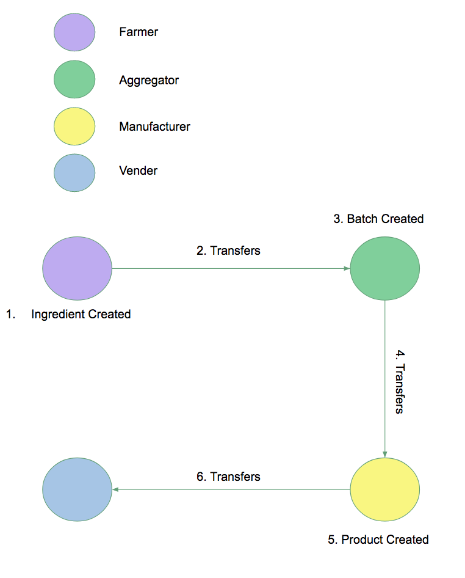
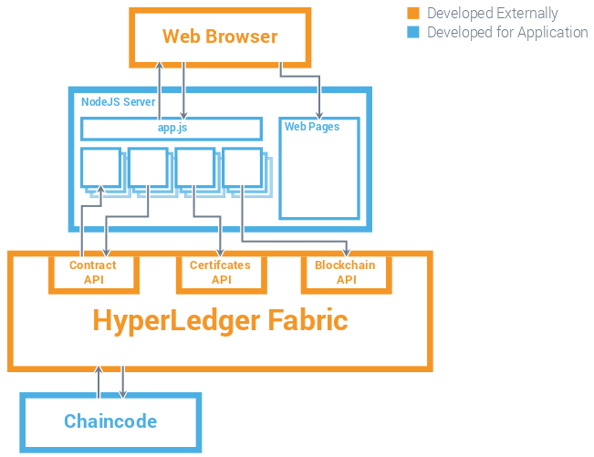

# qr-chain
Our goal at QRChain is to increase the transparency of the food supply chain.

##Application overview## This application is designed to demonstrate how food can leverage the Blockchain using the food supply chain to create transparency for the consumer.

The application is designed to allow participants to interact with the ingredient & product assets creating, updating and transferring them as their permissions allow. The participants included in the application are as follows:

| Participants | Permissions |
| --- | --- |
| Farmer | Create, Read, Update (Own ingredients), Delete (Own ingredients)|
| Aggregator | Read (Own ingredients), Update (Batch) |
| Manufacturer | Read (Own Ingredients/Products), Create, Delete, Update (Own Products) |
| Vendor | Read (Owned Products)|
| Regulator | Read (Products & Ingredients)|

The demonstration allows a view of the ledger that stores all the interactions that the above participants have has with their assets. The ledger view shows the regulator every transaction that has occurred showing who tried to to what at what time and to which product and ingredient. The ledger view also allows the user to see transactions that they were involved with as well as showing the interactions with the assets they own before they owned them e.g. they can see when it was created.

##Application scenario## The project goes through the lifecycle of the food supply chain which has the following stages:

####Stages:####
###Example
* Ingredient is created by the Farmer.
* Ingredient is sold to the Aggregator.
* Aggregator updates the ingredient with the batch information.
* Aggregator then sells the updated ingredient to the Manufacturer. 

Manufacturer then takes the ingredient and/or other products to create their final product.
Manufacturer then sells final product to Vendor to be sold to the consumer. 
Regulator (FDA) would be able perform oversight over this whole process if needed.

##Component model## This project is built using a 3 tier architecture. The user interacts with the blockchain using a web front end that is provided by the NodeJS server in the middle tier. This web front end uses JavaScript to make HTTP requests to the NodeJS server which has an API which in turn makes calls via HTTP to the HyperLedger fabric to get details about the blockchain and also interact with the chaincode.

